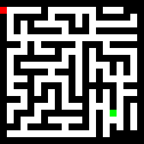
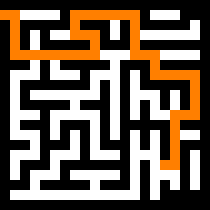

# Maze Solver
This is a command-line tool for validating and solving mazes. It can work with both textual representations and image-based maze formats, as long as a strict structure is adhered to. Upon solving a maze, the program will overlay the solution path onto the original maze image for visualisation.

## Input Formats

Textual: This should be a plain `.txt` file where:
- `W` represents maze-walls.
- ` ` represents empty space.
- `S` is the start point.
- `E` is the end point.

PNG image: pixels are interpreted as follows:
- `(0, 0, 0)`: for maze-walls.
- `(255, 255, 255)`: for empty space.
- `(255, 0, 0)`: for the start point.
- `(0, 255, 0)`: for the end point.

> Note: please find sample inputs and outputs within the `data` directory.

## Usage

- `python3 main.py --generate maze_text.txt`: Outputs a maze `png` image based on the textual input within the data directory.
- `python3 main.py --solve maze_img.png`: Outputs a solved maze `png` image within the data directory. (Exception will be raised if input is invalid, or if maze is unsolvable by BFS.)

## Worked example:

### Input `.txt` file:
```
  WWWWWWWWWWWWWWWWWWW
  S     W       W   W
W WWWWW WWW W WWWWW W
W W W     W W       W
W W WWWWW WWW WWWWWWW
W                   W
WWW W WWWWW WWW WWWWW
W   W   W   W W     W
W WWWWWWW W W WWWWW W
W W       W W   W W W
W WWWWW WWW W W W W W
W   W     W W W     W
W WWW WWW W WWWWW WWW
W   W W W W W W W   W
WWW WWW W WWW W W WWW
W   W   W   W   W W W
W WWW WWWWWWW W E W W
W W   W     W W   W W
WWW WWWWW WWW W W W W
W             W W   
WWWWWWWWWWWWWWWWWWW 
```

### Generated maze representation (resized for visibility):



### Solved maze representation (resized for visibility):

